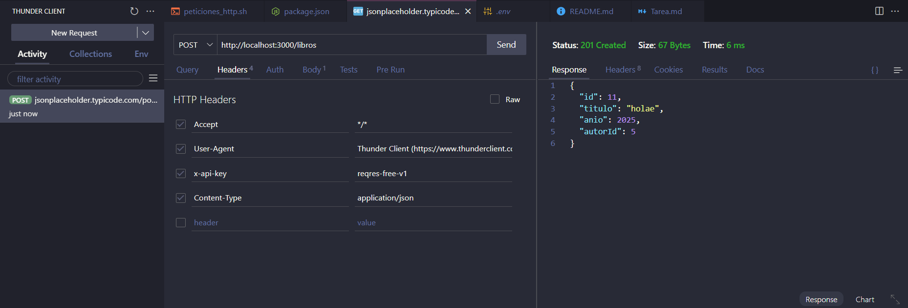
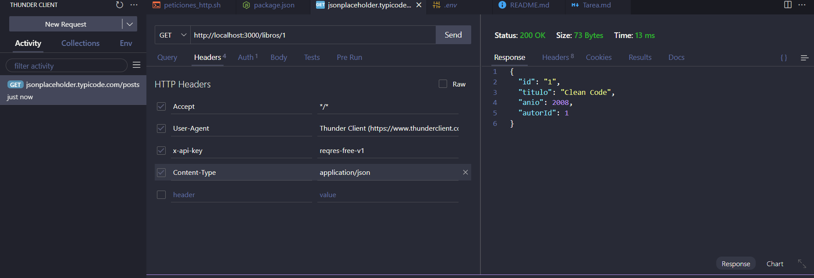
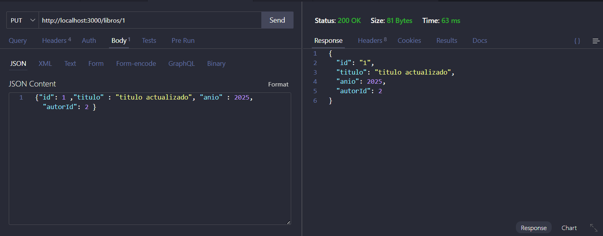
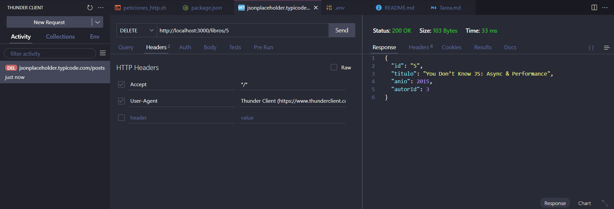

# Tarea CRUD usando THUNDER Client 
### POST
Con la operación POST lo que estamos haciendo es insertar un dato en la BD

### GET
Con la operación GET obtenemos un dato que se encuentra en la BD

### PUT
Con la operación PUT actualizamos un dato de la base de datos

### DELETE
Con la operación DELETE borramos un dato de la base de datos

